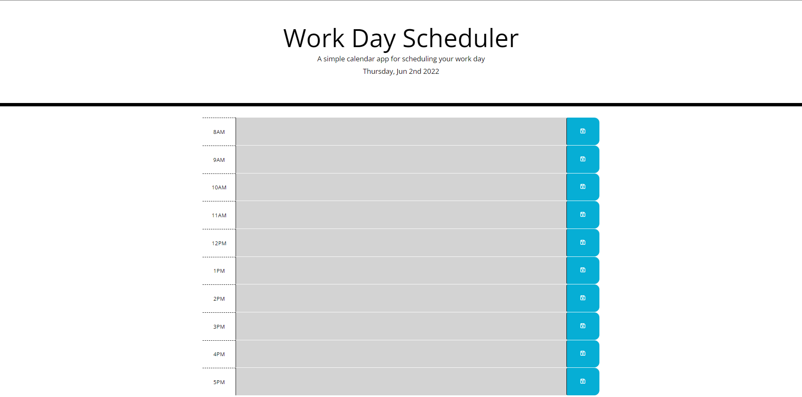

# Work Day Scheduler

## Description
- I have been tasked with building a work day scheduler to allow users to plan out their day. There are several features that have been implemented including:
* Displaying the current date in the head of the website
* Allows users to create tasks and save them and if they refresh the page all of their tasks will remain
* If the hour has pasted, that hour's description will change to gray
* If it's the current hour the hour's description will turn red
* All future hour descriptions are green indicicating the hour hasn't passed yet

### Links and Screenshot of Deployed Application
- Link: https://jschaefmn.github.io/work-day-scheduler/

